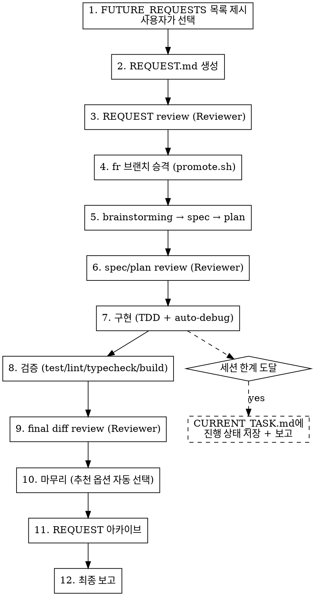

# Autopilot

FUTURE_REQUESTS에서 작업을 선택하고, 모든 리뷰를 포함한 전체 파이프라인을 자율 실행한다.

## Pipeline


```dot
digraph autopilot {
    rankdir=TB;
    node [shape=box];

    select [label="1. FUTURE_REQUESTS 목록 제시\n사용자가 선택"];
    request [label="2. REQUEST.md 생성"];
    request_review [label="3. REQUEST review (Reviewer)"];
    branch [label="4. fr 브랜치 승격 (promote.sh)"];
    design [label="5. brainstorming → spec → plan"];
    spec_review [label="6. spec/plan review (Reviewer)"];
    implement [label="7. 구현 (TDD + auto-debug)"];
    verify [label="8. 검증 (test/lint/typecheck/build)"];
    diff_review [label="9. final diff review (Reviewer)"];
    finish [label="10. 마무리 (추천 옵션 자동 선택)"];
    archive [label="11. REQUEST 아카이브"];
    report [label="12. 최종 보고"];

    select -> request -> request_review -> branch -> design -> spec_review;
    spec_review -> implement -> verify -> diff_review -> finish -> archive -> report;

    session_limit [label="세션 한계 도달" shape=diamond];
    save_state [label="CURRENT_TASK.md에\n진행 상태 저장 + 보고" shape=box style=dashed];

    implement -> session_limit [style=dashed];
    session_limit -> save_state [label="yes" style=dashed];
}
```

## Autonomy Override (모든 하위 skill에 우선)

autopilot 실행 중에는 아래 규칙이 **모든 하위 skill, prompt, 기본 행동보다 우선**한다.

**절대 멈추지 않는다:**
- "다음 단계는...", "다음: /skill-name" 안내 후 사용자 응답을 기다리지 않는다 — 바로 실행한다
- "어떻게 하시겠습니까?", "어떤 방식을 선호하시나요?" 묻지 않는다 — 추천안을 자율 선택한다
- review 완료 후 "마무리를 승인해주세요" 묻지 않는다 — Reviewer "이의 없음"이면 바로 다음 단계로 간다
- final-diff-review 완료 후 "merge할까요?" 묻지 않는다 — 추천 옵션을 자동 선택한다
- brainstorming의 interactive gate를 모두 자율 통과한다:
  - 요구사항 탐색 질문 → 세션 컨텍스트(REQUEST.md, PROJECT_CONTEXT.md, CURRENT_TASK.md, 대화 이력)에서 답변하고 진행
  - 설계 대안 제시 + 승인 요청 → 추천안(recommended)을 선택, 없으면 REQUEST의 제약/AC와 가장 부합하는 옵션 선택, 우열이 서지 않으면 가장 단순한 옵션 선택 (단, PROJECT_CONTEXT.md의 필수 제약을 위반하는 옵션은 제외)
  - 추가 확인 질문 → 기존 컨텍스트로 판단, 판단 불가 시에만 멈춤 (판단 근거를 최종 보고서 "주요 결정" 테이블에 기록)
  - 모든 옵션이 필수 제약을 위반하거나 판단 근거가 전혀 없으면 멈추고 사용자에게 보고
- writing-plans의 "execution choice" 질문을 따르지 않는다 — CLAUDE.md 실행 모드 규칙에 따라 자동 선택한다

**자율 판단 기준:**
- 2-3개 선택지가 있으면 추천안(recommended)을 선택한다
- 추천이 없으면 가장 단순한 옵션을 선택한다
- 판단 근거를 최종 보고서의 "주요 결정" 테이블에 기록한다

**유일한 예외 — 이때만 멈춘다:**
- review 50턴 도달 (autopilot에서는 20턴이 아닌 50턴까지 허용)
- 디버깅 3회 실패
- 사람의 우선순위 결정이 반드시 필요한 경우 (기술적 판단이 아닌 비즈니스 판단)
- 세션 한계 도달
- brainstorming에서 모든 옵션이 필수 제약을 위반하거나 판단 근거가 전혀 없는 경우

## autopilot 적합성 기준

특정 FR 을 autopilot 으로 자율 실행할 수 있는지 판단하는 단일 출처 기준이다. autopilot 의 작업 선택(§1)과 `/fr inspect` 의 판정이 이 기준을 공통으로 사용한다 (inspect 는 별도 로직을 복제하지 않고 이 섹션을 인용한다).

판정 항목:

1. **request seed 구체성**: FR 의 `request seed` 로 `REQUEST.md` 를 생성할 수 있는가. 비어 있거나 모호하면 부적합 또는 조건부(seed 보강 필요).
2. **설계 결정 자동선택 가능성**: 설계 대안을 추천안 / REQUEST 제약·AC 부합 / 최단 규칙으로 결정할 수 있는가. 사람만 내릴 수 있는 본질적 선택(제품 방향, 외부 의존 채택 등)이 작업의 핵심이면 조건부 또는 불가.
3. **범위 폐쇄성**: 외부 시스템·사람 입력에 의존하지 않고 작업 범위가 닫혀 있는가. 외부 의존이 크면 조건부 또는 불가.
4. **리스크·비가역성**: 비가역 작업(외부 발행, 데이터 삭제 등)이나 PROJECT_CONTEXT 필수 제약 위반 위험이 있는가. 있으면 조건부(사람 승인 필요) 또는 불가.

판정 종합:

- **가능**: 4개 항목 모두 자율 진행에 무리가 없다.
- **조건부 가능**: 일부 항목이 충족 조건(예: seed 보강, 특정 결정에 대한 사람 승인) 하에서만 자율 진행 가능하다. 충족 조건과 사람 결정 필요 여부를 분리해 적는다.
- **불가**: 본질적 사람 결정이 작업 핵심이거나, 비가역·제약 위반 위험이 자율 진행을 막는다. 차단 사유를 적는다.

## Execution Rules

### 1. 작업 선택

- `rd-workflow-workspace/backlog/FUTURE_REQUESTS.md`를 읽는다
- `validated` 또는 `ready-for-request` 상태 항목만 후보로 제시한다
- 후보가 없으면 `idea` 상태도 포함하되, 사용자에게 알린다
- 후보 내에서 priority 순으로 정렬한다: P1 → P2 → P3 → unranked(priority가 `-`이거나 필드 없음). 동순위는 날짜 오름차순
- priority는 후보 자격(status 게이트) 내에서의 정렬에만 사용한다. idea가 P1이라도 validated/ready-for-request 후보가 있으면 그쪽을 먼저 보여준다
- 각 항목의 priority를 읽으려면 상세 파일(`items/*.md`)의 `priority` 필드를 확인한다. priority 읽기/fallback 규칙은 `/fr list`와 동일: 필드 없음/`-` → unranked, malformed 값 → unranked + 경고, 상세 파일 누락 → 건너뜀 + 경고
- **AskUserQuestion으로 목록을 보여주고 사용자가 선택한다** — 목록에 priority 컬럼을 포함하여 정렬 이유를 사용자에게 보여준다
- 선택된 항목의 `request seed`를 기반으로 `REQUEST.md`를 생성한다
- REQUEST.md 생성 후 `CURRENT_TASK.md` Notes에 `started_at: YYYY-MM-DD HH:MM` 형식으로 현재 시각을 기록한다. autopilot 재실행 시 이전 값을 덮어쓴다.

### 2. 리뷰 — 3단계 전부 실행

모든 리뷰는 아래 패턴을 따른다:

```bash
# 세션 생성 (autopilot에서는 반드시 REVIEW_TURN_LIMIT=50을 넘긴다)
REVIEW_TURN_LIMIT=50 bash rd-workflow/scripts/prepare_review_pipeline.sh <review-kind> [args...]

# Claude 턴 작성 → Reviewer 턴 실행
bash rd-workflow/scripts/run_review_turn.sh <session-path>
```

- self-review(독립 reviewer 부재로 claude fallback) 시, autopilot은 `self_review_policy=block`이어도 차단되지 않고 자동 진행한다(자율성 보존). self-review 사용은 `mode=self-review`로 Tool History에 기록된다.

| 단계 | review-kind | 타이밍 |
|------|------------|--------|
| REQUEST review | `request` | REQUEST.md 생성 직후 |
| Spec/Plan review | `spec-plan [spec] [plan]` | spec + plan 작성 직후 |
| Final diff review | `diff` | 구현 + 검증 완료 후 |

**수렴 규칙:**
- 최신 Reviewer 턴이 "이의 없음"을 명시할 때까지 반복한다
- 50턴 도달 시 `awaiting-user`로 전환하고 사용자에게 보고한다 (일반 review의 20턴 대신 50턴)
- Reviewer 피드백으로 수정이 필요하면 자율적으로 반영한다

### 3. fr 브랜치 승격 (promote)

- spec/plan review 통과 후, 구현 시작 전에 lifecycle 정규 경로로 fr 브랜치를 만든다. **main worktree에서** 호출한다:
  ```bash
  bash rd-workflow/scripts/lifecycle/promote.sh --short-title <slug>
  ```
  - `<slug>`는 `CURRENT_TASK.md ## Short Title` 값이다(생략 시 promote.sh가 자동 추출).
  - promote.sh가 `fr/<slug>` 브랜치 + task-state fr 필드 기록(commit) + CURRENT_TASK 갱신을 생성하고 fr 브랜치로 전환한다. 이는 §6 step 7 archive.sh가 요구하는 형식과 일치한다.
- 구현 중 커밋은 이 `fr/<slug>` 브랜치에 쌓인다
- 마무리 단계에서 merge/PR/cleanup 중 추천 옵션을 자동 선택한다

### 4. 자율 구현

- **Superpowers가 사용 가능하면 반드시 사용한다:** `brainstorming` → `writing-plans` → CLAUDE.md 실행 모드 규칙에 따른 실행 모드. 사용 가능한데 건너뛰지 않는다.
- 테스트 실패, 빌드 에러 발생 시 `superpowers:systematic-debugging`으로 자율 디버깅한다
- 디버깅 3회 실패 시 현재 상태를 보고하고 사용자에게 넘긴다
- **model-strategy 적용**: `rd-workflow/config/model-strategy.json`이 존재하면 `subagent` 값을 읽어 subagent dispatch 시 Agent 도구의 `model` 파라미터로 전달한다. 파일 미존재/파싱 실패/키 누락/허용되지 않은 값(`opus`, `sonnet`, `haiku` 외) → 기본값 `"sonnet"`을 사용한다. 설정 형식 상세는 `/model-strategy` skill 참조.
- **subagent git 안전**: subagent dispatch 시 `rd-workflow/docs/guides/subagent-git-safety.md`의 Subagent Git 안전 문구를 dispatch prompt에 포함한다 (공유 워킹트리에서 git checkout/switch/branch/worktree 전환 금지, read-only git만 허용). read-only 탐색/리뷰 subagent는 `isolation: "worktree"` 격리를 권장한다.

### 5. 세션 한계 대응

컨텍스트가 커지면 `/compact`로 자동 압축을 시도한다. 세션 한계에 도달하기 전에 먼저 compact하고 작업을 이어간다.
compact로도 부족하면 **먼저 `CURRENT_TASK.md`에 현재 상태를 저장**한 뒤 사용자에게 보고한다. 묻기 전에 저장부터 한다.

compact 후에도 한계에 가까워지면:

1. `CURRENT_TASK.md`에 현재 진행 상태를 상세히 기록한다:
   - 완료된 단계
   - 현재 단계와 남은 작업
   - 열린 리뷰 세션 경로
   - 다음 세션에서 이어갈 명령
2. 커밋하고 보고한다: "여기까지 완료했고, 다음 세션에서 이어서 해달라"

### 6. 마무리

- **Final diff review가 완료(Reviewer "이의 없음" 명시)되기 전에는 마무리 단계로 넘어가지 않는다.**
- `superpowers:finishing-a-development-branch` skill의 옵션 중 추천을 자동 선택한다
- REQUEST 아카이브 절차 (아래 5단계를 순서대로 실행):

  1. **Short Title 읽기**: 아래 명령으로 `SHORT_TITLE` 변수를 설정한다.
     ```bash
     SHORT_TITLE=$(bash rd-workflow/scripts/rd task title)
     ```

  2. **REQUEST.md 백업**:
     ```bash
     bash rd-workflow/scripts/rd task backup-request
     ```
     실패(exit 2) 시 출력된 경고를 보고하고 중단한다.

  3. **같은 short-title 의 `request`/`spec`/`plan` stage 캡처를 `raw-captures/archive/` 로 이동**
     (`fr` stage 는 이동 안 함 — `/fr archive` 책임):
     ```bash
     bash rd-workflow/scripts/rd task archive-captures --stages request,spec,plan
     ```

  4. **Source FR 처리**: FUTURE_REQUESTS.md 인덱스에서 해당 항목의 상태를 `done`으로 변경하고, `items/` 상세 파일에서도 status를 `done`으로 표기한다.

  5. **REQUEST.md 비우기 + Short Title reset**: `REQUEST.md`를 초기 템플릿 상태로 비우고, `CURRENT_TASK.md`의 `## Short Title`을 기본값 `-`로 reset한다.

  6. **fr stage capture archive**: Source FR 의 status 가 `done` 으로 변경되었으므로 `/fr archive` 를 호출하여 같은 short-title 의 `fr` stage 캡처를 `raw-captures/archive/` 로 이동한다. (autopilot REQUEST archive 에서 `request`/`spec`/`plan` 캡처는 3단계에서 이미 이동됨. `fr` stage 는 이 단계에서 `/fr archive` 에 위임)

  7. **lifecycle 일괄 마무리**: 위 1–6단계(archive content commit)가 fr branch에서 완료된 후, main 으로 switch 하고 아래 명령을 실행한다:
     ```bash
     git checkout main
     bash rd-workflow/scripts/lifecycle/archive.sh
     ```
     `archive.sh` 가 merge + tag + push + branch/worktree 정리를 일괄 처리한다. 이 단계 실패 시 현재 상태를 보고하고 사용자에게 넘긴다.

**책임 경계**: `fr` stage 캡처는 `/fr archive` 책임이다. `request`/`spec`/`plan` stage 캡처는 REQUEST archive(autopilot 또는 수동) 책임이다.

### 7. 최종 보고

보고 파일을 `rd-workflow-workspace/reports/autopilot/YYYY-MM-DD-HHMM-작업명.md`에 저장하고, 내용을 사용자에게도 출력한다.

**완료 보고 마지막에 `/clear` 안내 (필수)**: 최종 보고를 출력한 뒤, lifecycle archive(§6 step 7 `archive.sh` = merge + push)까지 완료되어 모든 산출물이 손실 없이 보존됐으면 마지막에 컨텍스트 `/clear` 가능 여부를 반드시 한 줄 명시한다. 사용자가 추가 FR 등록 의사를 보이면 FR 등록을 먼저 처리한 뒤 안내한다.

보고 파일 형식:

```markdown
# Autopilot 완료 보고

- 일시: YYYY-MM-DD HH:MM
- REQUEST 아카이브: `rd-workflow-workspace/backlog/request-archive/YYYY-MM-DD-HHMM-작업명.md`

## 선택한 작업
- 항목: [제목]
- 이유: [왜 이 항목을 선택했는지 — 사용자가 선택]

## 진행 과정
1. [각 단계별 요약]

## 주요 결정
| 분기점 | 선택 | 대안 | 선택 이유 |
|--------|------|------|----------|
| 마무리 방식 | [merge/PR/...] | [다른 옵션들] | [이유] |
| ... | ... | ... | ... |

## 리뷰 요약
- REQUEST review: [한줄 요약] → `rd-workflow-workspace/reports/reviews/...-request-review.md`
- Spec/Plan review: [한줄 요약] → `rd-workflow-workspace/reports/reviews/...-spec-plan-review.md`
- Final diff review: [한줄 요약] → `rd-workflow-workspace/reports/reviews/...-diff-review.md`

## 실행 메트릭
- 소요 시간: [HH시간 MM분 또는 MM분 — `CURRENT_TASK.md` Notes의 `started_at` 기준으로 시스템 시계(로컬 시간대) 계산. started_at 없음 또는 형식 오류 시: `N/A (started_at 없음 또는 형식 오류)`]
- 토큰 사용량: N/A (Claude Code CLI 출력에서 확인)

## Rollback
- 브랜치: `fr/<slug>` (promote.sh 생성)
- 되돌리기: `bash rd-workflow/scripts/lifecycle/promote_rollback.sh` (main worktree에서 호출 — worktree 제거 + branch 삭제 + task-state fr 필드 reset + loop-guard 카운터 + CURRENT_TASK reset 일괄)
```
