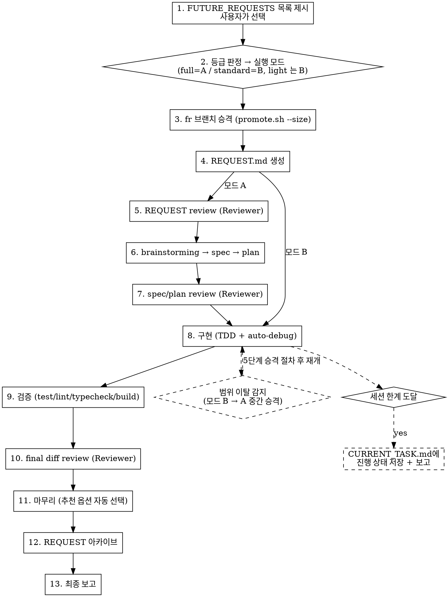

# Autopilot

FUTURE_REQUESTS에서 작업을 선택하고 파이프라인을 자율 실행한다. 실행 모드는 두 가지다 — 모드 A(`full` 등급: 모든 리뷰를 포함한 정식 절차 전부), 모드 B(`standard` 등급: final diff review 만). 모드는 `WORKFLOW.md` 위험 등급 절의 신호표로 판정한 등급이 정한다 ("실행 모드" 섹션).

## Pipeline


```dot
digraph autopilot {
    rankdir=TB;
    node [shape=box];

    select [label="1. FUTURE_REQUESTS 목록 제시\n사용자가 선택"];
    mode [label="2. 등급 판정 → 실행 모드\n(full=A / standard=B, light 는 B)" shape=diamond];
    branch [label="3. fr 브랜치 승격 (promote.sh --size)"];
    request [label="4. REQUEST.md 생성"];
    request_review [label="5. REQUEST review (Reviewer)"];
    design [label="6. brainstorming → spec → plan"];
    spec_review [label="7. spec/plan review (Reviewer)"];
    implement [label="8. 구현 (TDD + auto-debug)"];
    verify [label="9. 검증 (test/lint/typecheck/build)"];
    diff_review [label="10. final diff review (Reviewer)"];
    finish [label="11. 마무리 (추천 옵션 자동 선택)"];
    archive [label="12. REQUEST 아카이브"];
    report [label="13. 최종 보고"];

    select -> mode -> branch -> request;
    request -> request_review [label="모드 A"];
    request_review -> design -> spec_review -> implement;
    request -> implement [label="모드 B"];
    implement -> verify -> diff_review -> finish -> archive -> report;

    escalate [label="범위 이탈 감지\n(모드 B → A 중간 승격)" shape=diamond style=dashed];
    implement -> escalate [style=dashed];
    escalate -> implement [label="5단계 승격 절차 후 재개" style=dashed];

    session_limit [label="세션 한계 도달" shape=diamond];
    save_state [label="CURRENT_TASK.md에\n진행 상태 저장 + 보고" shape=box style=dashed];

    implement -> session_limit [style=dashed];
    session_limit -> save_state [label="yes" style=dashed];
}
```

## Autonomy Override (모든 하위 skill에 우선)

autopilot 실행 중에는 **자율 실행 공용 규칙**(`rd-workflow/docs/flows/AUTONOMY.md`)이 모든 하위 skill·prompt·기본 행동보다 우선한다 — "절대 멈추지 않는다"·"자율 판단 기준"·"중단 조건"을 그대로 따른다 (review 50턴, 디버깅 3회, loop-guard 등 중단 조건 포함).

**autopilot 특화 예외 게이트 (AUTONOMY.md 공용 규칙보다 우선):**
- §1의 작업 선택은 AskUserQuestion으로 **사용자가 결정한다**. 실행 모드는 등급 판정이 정하며 사용자는 이의가 있을 때만 바꾼다(하향은 사용자만 — "실행 모드" 섹션). 이 게이트 이후부터 AUTONOMY.md 규칙이 적용된다.

## autopilot 적합성 기준

특정 FR 을 autopilot 으로 자율 실행할 수 있는지 판단하는 단일 출처 기준이다. autopilot 의 작업 선택(§1)과 `/fr inspect` 의 판정이 이 기준을 공통으로 사용한다 (inspect 는 별도 로직을 복제하지 않고 이 섹션을 인용한다).

판정 항목:

1. **request seed 구체성**: FR 의 `request seed` 로 `REQUEST.md` 를 생성할 수 있는가. 비어 있거나 모호하면 부적합 또는 조건부(seed 보강 필요).
2. **설계 결정 자동선택 가능성**: 설계 대안을 추천안 / REQUEST 제약·AC 부합 / 최단 규칙으로 결정할 수 있는가. 사람만 내릴 수 있는 본질적 선택(제품 방향, 외부 의존 채택 등)이 작업의 핵심이면 조건부 또는 불가.
3. **범위 폐쇄성**: 외부 시스템·사람 입력에 의존하지 않고 작업 범위가 닫혀 있는가. 외부 의존이 크면 조건부 또는 불가.
4. **리스크·비가역성**: 비가역 작업(외부 발행, 데이터 삭제 등)이나 PROJECT_CONTEXT 필수 제약 위반 위험이 있는가. 있으면 조건부(사람 승인 필요) 또는 불가.

판정 종합:

- **가능**: 4개 항목 모두 자율 진행에 무리가 없다.
- **조건부 가능**: 일부 항목이 충족 조건(예: seed 보강, 특정 결정에 대한 사람 승인) 하에서만 자율 진행 가능하다. 충족 조건과 사람 결정 필요 여부를 분리해 적는다.
- **불가**: 본질적 사람 결정이 작업 핵심이거나, 비가역·제약 위반 위험이 자율 진행을 막는다. 차단 사유를 적는다.

## 실행 모드

autopilot은 두 실행 모드를 제공한다. 모드는 작업 선택 직후 `WORKFLOW.md` 위험 등급 절의 신호표로 판정한 등급이 정한다 (§1).

| 모드 | 등급 | 파이프라인 |
|------|------|-----------|
| **모드 A** | `full` | 정식 절차 전부 — REQUEST review → brainstorming → spec → plan → spec/plan review → 구현 → 검증 → final diff review |
| **모드 B** | `standard` (그리고 `light` — autopilot 은 FR 큐 기반이라 REQUEST·아카이브가 있는 경로로 실행한다) | REQUEST review·spec/plan 작성·spec/plan review 생략, 나머지 동일 |

### 모드 결정 규칙

- 작업 선택 직후 autopilot 이 등급과 근거 신호를 판정해 그 등급의 모드로 진행한다. 시작 보고 블록은 1회만 낸다 — 모드 A(`full`) 는 판정 직후이되 WORKFLOW.md 의 비변경 preflight `bash rd-workflow/scripts/lifecycle/start_preflight.sh` 를 먼저 실행해 그 `push 예정`·`미병합 브랜치 FR 후보` 줄을 블록에 적고, 모드 B 는 §3 promote 직전에 시작 계약 5항을 확인한 직후(`push 예정 = archive.sh 경유`) 낸다. 두 모드 모두 preflight exit 10(등록 커밋 형태가 아닌 ahead·behind·diverged·fetch 실패) 이면 autopilot 은 지시 대기가 없으므로 시작하지 않고 인계한다 — ahead 가 전부 FR 등록 커밋이면 자동 채택(exit 0) 되어 시작한다. preflight 의 fetch 실패는 `미push 수 판정 실패: 사유` 로 적고 무인 모드에서는 인계한다. 의미 신호로 판정 불가면 `full`(모드 A), 인접 두 등급 사이가 모호하면 높은 등급이다(`light`↔`standard` 는 `standard`/모드 B, `standard`↔`full` 은 `full`/모드 A).
- 상향은 언제나 가능하다. 하향은 사용자만 할 수 있고(`RD_AUTOPILOT_MODE=B` 또는 대화형 지시), 되돌리기 어려운 효과가 있는 FR 은 어떤 하향으로도 모드 B 가 될 수 없다. 사용자 하향은 REQUEST `## Risk Tier` 이력에 기록한다.

### 모드 B 실행 규칙

- **생략**: REQUEST review, brainstorming → spec → plan 설계 단계, spec/plan review
- **유지**: REQUEST.md 생성(§1 — 축약형, `## Risk Tier` 최종 등급 `standard`), fr 브랜치 승격(§3), 구현·검증(§4), 커밋 전 재분류, **final diff review(`standard`·`full` 필수)**, 마무리·아카이브(§6), 최종 보고(§7)
- **promote 타이밍**: 모드 A·B 모두 FR 등록 커밋 직후 promote 한다 (§3). 모드만 `--size` 값이 다르다 — A 는 `large`, B 는 `small`.
- **AC 게이트**: REQUEST.md의 Acceptance Criteria가 비어 있거나 모호하면 구현을 시작하지 않는다. request seed로부터 구체적 AC를 생성하는 것이 REQUEST 생성 단계의 책임이며, seed가 빈약해 AC를 만들 수 없으면 `awaiting-user`로 멈춘다.
- 그 외 공통 규칙(Autonomy Override, §4의 자율 구현 규칙 전체, §5 세션 한계 대응, §2 리뷰 수렴 규칙)은 모드 B에도 전부 동일 적용된다.

### 범위 이탈 시 중간 승격 (모드 B → 모드 A)

구현 중 `WORKFLOW.md` 위험 등급 절의 `full` 신호(되돌리기 어려운 효과, 워크플로 인프라 동작 변경, 인터페이스·데이터 모델·기존 동작 변경, 새 기능)가 하나라도 실제로 나타나면 **멈추지 않고** 모드 A로 승격한다. 감지 시점은 각 구현 사이클 시작 시와 구현 중 새 요구 발견 시다.

승격 절차 (5단계):

1. 현재까지의 구현을 fr 브랜치에 WIP 커밋한다 (구현 유지).
2. `CURRENT_TASK.md` Status를 `spec/plan 작성 중`으로 갱신하고 Notes에 승격 사유를 기록한다.
3. change-spec + plan을 소급 작성한다 — 이미 구현된 부분은 "현재 상태"로 반영하고 남은 작업을 plan Task로 정의한다 (`specs/changes/`, `plans/` 컨벤션 그대로).
4. spec/plan review를 실행한다 (§2 리뷰 패턴과 동일). Reviewer가 기존 구현의 문제를 지적하면 자율 수정한다.
5. 리뷰 통과 후 잔여 구현부터 모드 A와 완전히 동일하게 진행한다.

- **REQUEST review는 소급하지 않는다** — 범위 이탈은 규모 추정의 문제이지 REQUEST의 문제가 아니다. REQUEST 자체의 전제가 깨진 경우(요구사항 변화)는 기존 예외("사람의 우선순위 결정이 반드시 필요한 경우")에 따라 멈춘다.
- 승격은 단방향이다 (모드 A → B 강등 없음).
- 승격 사실과 사유를 최종 보고서 "주요 결정" 테이블에 기록한다.

## 무인 진입 (headless / unattended)

`claude -p` 헤드리스에서 사람 개입 없이 autopilot 을 완주시키는 비대화형 진입 경로다. 두 front-end(ralph 무인 큐 드레인 · batch 큐레이션 묶음)가 공통으로 이 경로를 통해 진입하며, 얇은 wrapper `rd-workflow/scripts/autopilot_headless.sh` 가 진입점이다. front-end A(ralph 무인 큐 드레인)의 진입점은 supervisor 스크립트 `rd-workflow/scripts/ralph_drain.sh` 다 — wrapper 를 `RD_AUTOPILOT_FR=auto` 로 반복 호출해 준비된 큐를 소진하고, exit code(0/10/20/30/40)만 보고 계속/중단하며 blocked FR 은 위 status=blocked 처리로 자동 제외된다. 오케스트레이션 지능은 넣지 않는다.

### 활성화 신호

- 환경변수 `RD_AUTOPILOT_FR` 이 설정되어 있으면 무인 분기로 동작한다. unset 이면 기존 대화형 분기(§1 AskUserQuestion)로 동작한다 (기존 동작 불변).
- 무인 분기에서는 §1 작업 선택의 `AskUserQuestion` 호출을 전면 금지한다. 헤드리스에는 AskUserQuestion 도구가 존재하지 않으므로, 반드시 환경변수로 대체한다.

### 결과 대기 규율 (백그라운드 금지)

무인 분기의 필수 제약이다 (위 AskUserQuestion 금지와 같은 층위). 이 규율은 Claude Code headless 실행 환경의 도구 계약(`timeout` 최대치, 장시간 명령의 자동 백그라운드 이관)에 근거하므로, 다른 harness 로 이 템플릿을 운용하는 경우에는 동일 동작이 보장되지 않는다.

**갈림길은 "명령이 오래 걸리는가" 가 아니라 "누가 백그라운드를 시작했는가" 다.**

| 백그라운드 시작 주체 | 결과 |
|---|---|
| 세션이 스스로 `run_in_background: true` 로 던짐 | **자멸** — 응답을 내는 순간 프로세스가 종료되어 결과를 수령할 주체가 사라진다. outcome 이 빈 채 남아 wrapper 가 `harness-error`(exit 40) 로 매핑한다 |
| foreground 명령이 시간 초과로 harness 가 자동 이관 | **정상** — 완료 알림으로 재진입한다 |

1. **결과가 필요한 명령을 `run_in_background: true` 로 시작하지 않는다.** 리뷰 턴 실행, 빌드, 검증 스크립트, subagent dispatch 가 모두 해당한다. 결과를 쓰지 않고 던져두기만 하는 명령에만 백그라운드를 쓴다.

   이 금지는 산문 규율이 아니라 **`headless_background_gate.sh` PreToolUse hook 으로 강제됩니다.** `RD_AUTOPILOT_FR` 이 설정된 세션에서 `run_in_background: true` Bash 호출은 exit 2 로 차단되며, 차단 메시지가 foreground 대안(`timeout` 최대치)과 리뷰 턴의 `WAIT_TIMEOUT` 조정법을 함께 제시합니다. hook 은 positive 감지에만 차단하므로(파싱 불가·필드 부재는 통과) 정상 호출을 막지 않습니다.
2. **긴 명령도 foreground 로 건다.** `timeout` 을 최대치인 `600000ms` 로 지정하고, 그보다 오래 걸리면 harness 의 자동 백그라운드 이관에 맡긴다. 스스로 백그라운드를 선택하지 않는다.

   **명령 자체에 watchdog 이 있으면 안쪽을 바깥보다 크게 잡는다.** `run_review_turn.sh` 의 어댑터는 두 축으로 대기한다 — 유휴 임계 `RD_REVIEW_IDLE_TIMEOUT`(기본 600초)과 절대 상한 `WAIT_TIMEOUT`(기본 7200초). **codex 가 출력을 내는 동안에는 유휴 타이머가 계속 갱신되므로, 정상 진행 중인 턴이 상한 전에 잘리지 않는다.** 따라서 종전처럼 `WAIT_TIMEOUT` 을 매번 올려 걸 필요가 없다.

   ```bash
   bash rd-workflow/scripts/run_review_turn.sh <session-path>
   ```

   기본값으로 충분하다. 대상이 유난히 크거나 이전 회차가 상한에서 끊겼다면 그때만 `WAIT_TIMEOUT` 을 올린다.
3. **소요 시간으로 자기 판단하지 않는다.** 리뷰 종류별 실측 소요는 편차가 크다.

   | 리뷰 종류 | 실측 소요 |
   |---|---|
   | REQUEST review (턴당) | 64~89초 |
   | spec/plan review | 약 26분 |
   | final diff review | 600초 초과 |

   한 종류의 값을 다른 종류에 적용하면 안 된다. 위 값은 특정 회차의 **관측값이지 보장치가 아니며**, 대상 규모·모델·부하에 따라 달라진다. 이 표의 목적은 값을 신뢰하라는 것이 아니라 종류마다 다르므로 한 값을 일반화하지 말라는 것이다. **이 표의 값은 더 이상 타임아웃 설정의 근거가 아니다** — 유휴 기반 대기로 바뀌어 소요 시간 자체가 판정 기준이 아니기 때문이다. 표는 "리뷰 종류마다 소요가 다르다"는 사실만 말한다.
4. **세션 수명이 다하면 백그라운드로 도망가지 않는다.** `CURRENT_TASK.md` 에 진행 상태를 저장한 뒤 outcome 에 `resume` 을 기록하고 정상 종료한다. 재개에 필요한 세 정보 — **중단 이유 / 도달 단계 / 다음 재개 지점** — 를 두 곳에 남긴다.
   - `CURRENT_TASK.md` — §5 의 기존 항목(완료된 단계, 현재 단계와 남은 작업, 열린 리뷰 세션 경로, 다음 세션에서 이어갈 명령)으로 충족한다.
   - outcome 파일의 **2줄 이후** 요약. **첫 줄은 토큰 전용이다** — wrapper 가 `head -n1` 로 첫 줄만 읽으므로, 첫 줄에 요약을 섞으면 토큰 판독이 깨져 `harness-error` 로 오분류된다.
5. **긴 foreground 에 들어가기 전에 무엇을 기다리는지 남긴다.** 최대 600초의 무응답 구간은 겉보기에 정체와 구별되지 않는다. 무인 세션에는 화면을 보는 사람이 없으므로 파일이 유일한 관찰 지점이다. 명령 실행 **직전** `CURRENT_TASK.md` Notes 에 진행 신호 한 줄을 기록하고, 복귀 후 같은 줄을 결과로 갱신한다.

   ```
   waiting: final diff review 턴 003 / run_review_turn.sh / started 17:42
   ```

### 환경변수 계약

| 변수 | 값 | 역할 |
|------|-----|------|
| `RD_AUTOPILOT_FR` | `<slug>` \| `auto` | 존재=무인 활성화. `<slug>`=명시 FR, `auto`=priority 자동선택 |
| `RD_AUTOPILOT_MODE` | `A` \| `B` | 미지정이면 등급 판정이 모드를 정한다. 지정하면 사용자 override 로 취급한다(`B` 는 하향 — 되돌리기 어려운 효과가 있는 FR 에는 적용되지 않고 A 로 진행 + 보고) |
| `RD_FINISH_POLICY` | `push` \| `merge` \| `none` | 미지정 시 `push`. `push`=정규 archive.sh 전체, `merge`=로컬 merge+tag(push 생략), `none`=fr branch 커밋만 |
| `RD_AUTOPILOT_OUTCOME_FILE` | 경로 | outcome 기록 대상. wrapper 가 설정해 주입 (기본 `rd-workflow-workspace/.autopilot-outcome`) |

### 무인 분기 작업 선택 (§1 게이트 대체)

1. **resume 우선**: `CURRENT_TASK.md` 에 미완 작업(Status ≠ `대기 중` 그리고 Short Title ≠ `-`)이 있으면 그 FR 을 재개한다 (§5 재사용). `RD_AUTOPILOT_FR` 이 다른 slug 를 가리켜도 resume 이 우선하며, 불일치는 outcome 요약에 한 줄 남긴다.
2. else `RD_AUTOPILOT_FR=<slug>` → 그 FR 을 선택한다.
3. else `RD_AUTOPILOT_FR=auto` → validated / ready-for-request 후보에서 priority 자동선택한다 (§1 정렬 규칙: P1→P2→P3→unranked, 동순위 날짜 오름차순).
4. else (auto 인데 후보 없음) → outcome `queue-empty` 기록 후 종료한다.

모드는 `RD_AUTOPILOT_MODE` 가 미지정이면 등급 판정이 정한다(`full`→A, `standard`→B, `light` FR 은 B). 지정하면 사용자 override 로 취급한다. 이 두 게이트 이후부터는 AUTONOMY.md 자율 규칙을 그대로 적용한다.

### outcome 기록 (종료 신호)

무인 분기에서는 종료 시 반드시 `$RD_AUTOPILOT_OUTCOME_FILE`(미설정 시 `rd-workflow-workspace/.autopilot-outcome`) 의 첫 줄에 아래 토큰 하나를 기록한다. wrapper 가 이를 exit code 로 매핑한다.

| outcome 토큰 | 의미 |
|--------------|------|
| `completed` | FR 완료 + `RD_FINISH_POLICY` 대로 archive 수행 |
| `resume` | 세션 한계 도달, CURRENT_TASK 저장, 잔여 작업 있음 |
| `blocked:<reason>` | AUTONOMY 중단조건 도달. `<reason>` 은 하이픈 식별자(예: `review-50turn`, `debug-3fail`, `loop-guard`, `human-decision`) |
| `queue-empty` | auto-pick 후보 없음 |

### 중단조건 → blocked 매핑 (무인 특화)

무인 모드에서는 사람을 기다릴 수 없다. AUTONOMY.md 중단조건(review 50턴 / 디버깅 3회 / loop-guard / 본질적 사람 결정 / 판단 근거 없음)에 도달하면, "awaiting-user 로 멈춰 대기" 하는 대신 아래를 수행하고 종료한다:

1. `blocked:<reason>` outcome 을 `$RD_AUTOPILOT_OUTCOME_FILE` 에 기록한다.
2. 해당 FR 의 status 를 `blocked` 로 기록한다 (FUTURE_REQUESTS.md 인덱스 status 컬럼 + `items/` 상세 파일 status, 상세에 중단 사유 한 줄 병기). auto-pick 화이트리스트(validated/ready-for-request)가 이 FR 을 자동 제외한다.
3. `CURRENT_TASK.md` 를 초기화한다 — Status `대기 중`, Short Title `-` (rd task set-status 경유). 이로써 다음 iteration 의 resume-우선 규칙이 같은 FR 을 재개하지 않는다.

이 처리로 "보존해야 할 상태"가 CURRENT_TASK 에서 FR 의 blocked 항목(사유 포함)으로 옮겨간다. exit 20 이후 처리(다음 FR 이동 / continue-on-failure)는 front-end 소관이다.

## Execution Rules

### 1. 작업 선택

- `rd-workflow-workspace/backlog/FUTURE_REQUESTS.md`를 읽는다
- `validated` 또는 `ready-for-request` 상태 항목만 후보로 제시한다
- 후보가 없으면 `idea` 상태도 포함하되, 사용자에게 알린다
- 후보 내에서 priority 순으로 정렬한다: P1 → P2 → P3 → unranked(priority가 `-`이거나 필드 없음). 동순위는 날짜 오름차순
- priority는 후보 자격(status 게이트) 내에서의 정렬에만 사용한다. idea가 P1이라도 validated/ready-for-request 후보가 있으면 그쪽을 먼저 보여준다
- 각 항목의 priority를 읽으려면 상세 파일(`items/*.md`)의 `priority` 필드를 확인한다. priority 읽기/fallback 규칙은 `/fr list`와 동일: 필드 없음/`-` → unranked, malformed 값 → unranked + 경고, 상세 파일 누락 → 건너뜀 + 경고
- **AskUserQuestion으로 목록을 보여주고 사용자가 선택한다** — 목록에 priority 컬럼을 포함하여 정렬 이유를 사용자에게 보여준다
- 항목 선택 직후 등급을 판정해 실행 모드를 정한다 — "실행 모드" 섹션의 모드 결정 규칙을 따른다 (시작 보고 블록은 모드 A 는 여기서, 모드 B 는 §3 시작 계약 확인 직후 1회; 사용자는 이의 시만 변경)
- **선택한 항목의 상세 파일 경로(`rd-workflow-workspace/backlog/items/<파일>.md`)를 기억한다.** 이 값이 §3 승격의 `--source-fr` 인자다. 이 단계가 유일한 producer이고, promote가 REQUEST.md보다 앞서므로 REQUEST 본문에서 추론할 수 없다.
- **다음은 §3 승격이다** (아래 `REQUEST.md` 생성보다 **앞**). 문서상 §3에 적혀 있으나 실행 순서는 여기가 먼저다.
- §3 승격 완료 후, 선택된 항목의 `request seed`를 기반으로 `REQUEST.md`를 생성한다. REQUEST의 `## Source FR`에는 위에서 §3에 넘긴 것과 같은 경로를 쓴다 (권위는 task-state이고 REQUEST는 사람이 읽는 기록이다)
- REQUEST.md 생성 후 `CURRENT_TASK.md` Notes에 `started_at: YYYY-MM-DD HH:MM` 형식으로 현재 시각을 기록한다. autopilot 재실행 시 이전 값을 덮어쓴다.

### 2. 리뷰 — 모드 A는 3단계 전부, 모드 B는 final diff review만

모드별 리뷰 범위는 "실행 모드" 섹션을 따른다. 모든 리뷰는 아래 패턴을 따른다:

```bash
# 세션 생성 (autopilot에서는 반드시 REVIEW_TURN_LIMIT=50을 넘긴다)
REVIEW_TURN_LIMIT=50 bash rd-workflow/scripts/prepare_review_pipeline.sh <review-kind> [args...]

# Claude 턴 작성 → Reviewer 턴 실행
# 어댑터는 유휴 기반으로 대기하므로 기본값으로 충분하다 (「무인 진입」 § 결과 대기 규율 2)
bash rd-workflow/scripts/run_review_turn.sh <session-path>
```

- self-review(독립 reviewer 부재로 claude fallback) 시, autopilot은 `self_review_policy=block`이어도 차단되지 않고 자동 진행한다(자율성 보존). self-review 사용은 `mode=self-review`로 Tool History에 기록된다.

| 단계 | review-kind | 타이밍 |
|------|------------|--------|
| REQUEST review | `request` | REQUEST.md 생성 직후 |
| Spec/Plan review | `spec-plan [spec] [plan]` | spec + plan 작성 직후 |
| Final diff review | `diff` | 구현 + 검증 완료 후 |

- **task별 리뷰 생략 (mechanical)**: plan의 review flag가 `mechanical`인 task는 task별 리뷰어 dispatch를 생략하고 final diff review에 위임한다. `needs-review`(또는 flag 부재)인 task만 리뷰어를 dispatch한다. 판정 기준(3조건)과 final diff 불변은 `rd-workflow/docs/guides/plan-parallel-phases.md` 참조. 이 생략은 리뷰에만 적용되며 검증(test/lint/build)과 loop-guard 시그널에는 영향을 주지 않는다.

**수렴 규칙:**
- 최신 Reviewer 턴이 "이의 없음"을 명시할 때까지 반복한다
- 50턴 도달 시 `awaiting-user`로 전환하고 사용자에게 보고한다 (일반 review의 20턴 대신 50턴)
- Reviewer 피드백으로 수정이 필요하면 자율적으로 반영한다

### 3. fr 브랜치 승격 (promote)

- **FR 등록 커밋 직후** — 모드 A·B 공통이며 REQUEST.md 작성보다 **앞**이다. 실제 실행이 이 순서이고(`lifecycle/README.md` 규약과 일치), 종전 서술("모드 A는 spec/plan review 통과 후")은 실행과 어긋나 2026-08-21 에 정정했다. **기본 브랜치 worktree에서** 호출한다:
  모드 A (큰 작업):
  ```bash
  bash rd-workflow/scripts/lifecycle/promote.sh --short-title <slug> --size large \
    --source-fr rd-workflow-workspace/backlog/items/<선택한-항목>.md
  ```
  모드 B (작은 작업) — `--size` 만 다르다:
  ```bash
  bash rd-workflow/scripts/lifecycle/promote.sh --short-title <slug> --size small \
    --source-fr rd-workflow-workspace/backlog/items/<선택한-항목>.md
  ```
  - **모드에 맞는 블록을 골라 쓴다.** 두 모드를 한 블록으로 두면 그대로 복사하는 실행자가 작은 작업도 `large` 로 시작해, 추가 전이·`--force` 우회 문제가 되살아난다. 이 계약은 `rd-workflow/scripts/check_autopilot_promote_contract.sh` 가 정적으로 점검한다 — 모드 라벨과 `--size` 값의 대응, 명령마다의 `--source-fr` canonical 경로까지 본다. 자연어 문장의 의미 반전은 점검 범위가 아니므로 사람 리뷰가 받는다.
  - **모드 B 는 promote 호출 전에 WORKFLOW.md 시작 계약 5항**(Status 대기 중 → 기본 브랜치 clean 선확인 → `start_preflight.sh` exit 10 이면 시작하지 않고 인계(등록 커밋만 ahead 면 자동 채택), 사용자 명시 채택 시 진행 → baseline HEAD) 을 확인하고 **그 직후 시작 보고 블록을 1회** 낸다. 모드 A 는 모드 결정 시점에 이미 냈으므로 여기서 다시 내지 않는다.
  - `large` 는 시작 상태 `대기 중`(다음 단계 `REQUEST review 대기` 로 `--force` 없이 전이), `small` 은 `구현 중` 이다.
  - **`--source-fr` 를 반드시 명시한다.** 이 호출은 REQUEST.md 작성보다 앞서므로 REQUEST 본문에서 Source FR 을 읽을 수 없다. 생략하면 baseline REQUEST 의 `-` 가 기록되어(또는 stale REQUEST 가 남아 있으면 이전 작업 경로가 기록되어) §6 archive 의 FR done 자동 처리가 무동작하거나 다른 FR 을 건드린다. 값은 §1 에서 기억한 그 경로다.
  - `<slug>`는 `CURRENT_TASK.md ## Short Title` 값이다(생략 시 promote.sh가 자동 추출).
  - promote.sh가 `fr/<slug>` 브랜치 + task-state fr 필드 기록(commit) + CURRENT_TASK 갱신을 생성하고 fr 브랜치로 전환한다. 이는 §6 step 7 archive.sh가 요구하는 형식과 일치한다.
- 구현 중 커밋은 이 `fr/<slug>` 브랜치에 쌓인다
- 마무리 단계에서 merge/PR/cleanup 중 추천 옵션을 자동 선택한다

### 4. 자율 구현

- **Superpowers가 사용 가능하면 반드시 사용한다:** `brainstorming` → `writing-plans` → CLAUDE.md 실행 모드 규칙에 따른 실행 모드. 사용 가능한데 건너뛰지 않는다.
- 테스트 실패, 빌드 에러 발생 시 `superpowers:systematic-debugging`으로 자율 디버깅한다
- 디버깅 3회 실패 시 현재 상태를 보고하고 사용자에게 넘긴다
- **model-strategy 적용**: `rd-workflow/config/model-strategy.json`이 존재하면 `subagent` 값을 읽어 subagent dispatch 시 Agent 도구의 `model` 파라미터로 전달한다. 파일 미존재/파싱 실패/키 누락/허용되지 않은 값(`opus`, `sonnet`, `haiku` 외) → 기본값 `"sonnet"`을 사용한다. 설정 형식 상세는 `/model-strategy` skill 참조.
- **subagent git 안전**: subagent dispatch 시 `rd-workflow/docs/guides/subagent-git-safety.md`의 Subagent Git 안전 문구를 dispatch prompt에 포함한다 (공유 워킹트리에서 git checkout/switch/branch/worktree 전환 금지, read-only git만 허용). read-only 탐색/리뷰 subagent는 `isolation: "worktree"` 격리를 권장한다.
- **phase 병렬 실행**: plan이 phase(파일 비중첩 task 그룹)를 표현하면 phase 내 task 구현자를 병렬 dispatch하고, barrier 후 **orchestrator(실행 세션 본체)가 커밋**한다. 검증은 phase barrier 후 1회 실행한다. 절차 전체는 `rd-workflow/docs/guides/plan-parallel-phases.md`를 따른다. phase 미표현 plan은 순차 실행으로 degrade한다.

### 5. 세션 한계 대응

컨텍스트가 커지면 `/compact`로 자동 압축을 시도한다. 세션 한계에 도달하기 전에 먼저 compact하고 작업을 이어간다.
compact로도 부족하면 **먼저 `CURRENT_TASK.md`에 현재 상태를 저장**한 뒤 사용자에게 보고한다. 묻기 전에 저장부터 한다.

compact 후에도 한계에 가까워지면:

1. `CURRENT_TASK.md`에 현재 진행 상태를 상세히 기록한다:
   - 완료된 단계
   - 현재 단계와 남은 작업
   - 열린 리뷰 세션 경로
   - 다음 세션에서 이어갈 명령
2. 커밋하고 보고한다: "여기까지 완료했고, 다음 세션에서 이어서 해달라"

### 6. 마무리

- **Final diff review가 완료(Reviewer "이의 없음" 명시)되기 전에는 마무리 단계로 넘어가지 않는다.**
- `superpowers:finishing-a-development-branch` skill의 옵션 중 추천을 자동 선택한다
- REQUEST 아카이브 절차 (아래 5단계를 순서대로 실행):

  1. **Short Title 읽기**: 아래 명령으로 `SHORT_TITLE` 변수를 설정한다.
     ```bash
     SHORT_TITLE=$(bash rd-workflow/scripts/rd task title)
     ```

  2. **REQUEST.md 백업**:
     ```bash
     bash rd-workflow/scripts/rd task backup-request
     ```
     실패(exit 2) 시 출력된 경고를 보고하고 중단한다. 출력이 `건너뜀 — REQUEST.md 가 초기 템플릿 상태입니다` (exit 0) 이면 보존할 내용이 없어 백업 파일을 만들지 않은 정상 경로이므로 그대로 진행한다.

  3. **같은 short-title 의 `request`/`spec`/`plan` stage 캡처를 `raw-captures/archive/` 로 이동**
     (`fr` stage 는 이동 안 함 — `/fr archive` 책임):
     ```bash
     bash rd-workflow/scripts/rd task archive-captures --stages request,spec,plan
     ```

  4. **Source FR 처리**:
     ```bash
     bash rd-workflow/scripts/rd task fr-done
     ```
     인자 없이 부르면 task-state 의 `source-fr` 집합 전부가 대상이다. `fr-done` 이 묶은 FR 전부의 `items/` status 와 인덱스 행 status 를 함께 `done` 으로 바꾸고, **인덱스 행 삭제는 `/fr archive`(아래 6단계)가 그 status 를 보고 수행한다** — `fr-done` 이 status 를 바꾸지 않으면 `/fr archive` 가 0건으로 끝나 FR 이 활성으로 남는다.

     **실패해도 다음 단계(발행)를 멈추지 않는다.** exit 1(실패 1건 이상)이면 `fr-done` 출력을 최종 보고서의 「FR 정리 결과」 절에 그대로 옮기고(`auto_completion_report` 가 꺼진 프로젝트는 아카이브된 REQUEST 사본 말미에), §7 최종 보고에서 **발행 결과와 FR 정리 결과를 두 줄로 분리**해 보고한다. 재시도 대상 목록은 발행 후 task-state 가 초기화되므로 아카이브된 REQUEST 사본의 `## Source FR` 과 보고서의 「FR 정리 결과」 절에서 회수해 `bash rd-workflow/scripts/rd task fr-done <path>...` 로 다시 부른다. 상세는 `fr/archive.md` 참조.

  5. **REQUEST.md 비우기 + Short Title reset**: `REQUEST.md`를 초기 템플릿 상태로 비우고, `CURRENT_TASK.md`의 `## Short Title`을 기본값 `-`로 reset한다.

  6. **fr stage capture archive**: Source FR 의 status 가 `done` 으로 변경되었으므로 `/fr archive` 를 호출하여 같은 short-title 의 `fr` stage 캡처를 `raw-captures/archive/` 로 이동한다. (autopilot REQUEST archive 에서 `request`/`spec`/`plan` 캡처는 3단계에서 이미 이동됨. `fr` stage 는 이 단계에서 `/fr archive` 에 위임)

  7. **lifecycle 일괄 마무리**: 위 1–6단계(archive content commit)가 fr branch에서 완료된 후, 기본 브랜치로 switch 하고 아래 명령을 실행한다:
     ```bash
     git checkout main  # 기본 브랜치 (master/trunk 프로젝트는 해당 브랜치 — workflow.json default_branch 참조)
     bash rd-workflow/scripts/lifecycle/archive.sh
     ```
     `archive.sh` 가 merge + tag + push + branch/worktree 정리를 일괄 처리한다. 이 단계 실패 시 현재 상태를 보고하고 사용자에게 넘긴다.

**책임 경계**: `fr` stage 캡처는 `/fr archive` 책임이다. `request`/`spec`/`plan` stage 캡처는 REQUEST archive(autopilot 또는 수동) 책임이다.

### 7. 최종 보고

보고 파일을 `rd-workflow-workspace/reports/autopilot/YYYY-MM-DD-HHMM-작업명.md`에 저장하고, 내용을 사용자에게도 출력한다.

**완료 보고 마지막에 `/clear` 안내 (필수)**: 최종 보고를 출력한 뒤, lifecycle archive(§6 step 7 `archive.sh` = merge + push)까지 완료되어 모든 산출물이 손실 없이 보존됐으면 마지막에 컨텍스트 `/clear` 가능 여부를 반드시 한 줄 명시한다. 사용자가 추가 FR 등록 의사를 보이면 FR 등록을 먼저 처리한 뒤 안내한다.

보고 파일 형식:

```markdown
# Autopilot 완료 보고

- 일시: YYYY-MM-DD HH:MM
- REQUEST 아카이브: `rd-workflow-workspace/backlog/request-archive/YYYY-MM-DD-HHMM-작업명.md`

## 선택한 작업
- 항목: [제목]
- 이유: [왜 이 항목을 선택했는지 — 사용자가 선택]

## 진행 과정
1. [각 단계별 요약]

## 주요 결정
| 분기점 | 선택 | 대안 | 선택 이유 |
|--------|------|------|----------|
| 실행 모드 | [모드 A/모드 B] (등급: [full/standard/light] — 근거 신호) | [다른 모드] | [등급 판정 결과. 사용자 override·중간 승격 시 사유 병기] |
| 마무리 방식 | [merge/PR/...] | [다른 옵션들] | [이유] |
| ... | ... | ... | ... |

## 리뷰 요약
<!-- 모드 B에서 생략된 리뷰는 `생략 (모드 B)`로 표기하고 링크 대신 `-`를 적는다. Final diff review는 모든 모드에서 필수 (링크 생략 불가). 중간 승격 시 Spec/Plan review는 수행되므로 링크를 기록한다. -->
- REQUEST review: [한줄 요약 | 생략 (모드 B)] → [`rd-workflow-workspace/reports/reviews/...-request-review.md` | -]
- Spec/Plan review: [한줄 요약 | 생략 (모드 B)] → [`rd-workflow-workspace/reports/reviews/...-spec-plan-review.md` | -]
- Final diff review: [한줄 요약] → `rd-workflow-workspace/reports/reviews/...-diff-review.md`

## 실행 메트릭
- 소요 시간: [HH시간 MM분 또는 MM분 — `CURRENT_TASK.md` Notes의 `started_at` 기준으로 시스템 시계(로컬 시간대) 계산. started_at 없음 또는 형식 오류 시: `N/A (started_at 없음 또는 형식 오류)`]
- 토큰 사용량: N/A (Claude Code CLI 출력에서 확인)

## Rollback
- 브랜치: `fr/<slug>` (promote.sh 생성)
- 되돌리기: `bash rd-workflow/scripts/lifecycle/promote_rollback.sh` (기본 브랜치 worktree에서 호출 — worktree 제거 + branch 삭제 + task-state fr 필드 reset + loop-guard 카운터 + CURRENT_TASK reset 일괄)
```
